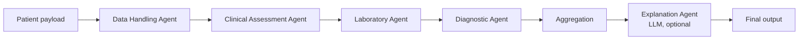

# Strata: Multi-Agent Clinical Decision Support for Type 2 Diabetes

Strata is a **multi-agent system (MAS)** that helps clinicians assess and triage
**Type 2 Diabetes (T2D) risk**. It was built for an **MSc Artificial Intelligence
dissertation**.

A patient's details go through five specialised agents: data handling, clinical
risk, laboratory reasoning, guideline-based diagnosis and explanation. The result
is a structured assessment that a clinician can review, shown in a React web app.

> **Research prototype.** Strata is not a medical device and must not be used to
> diagnose or treat real patients.

---

## Contents

1. [Project goals](#1-project-goals)
2. [How it works](#2-how-it-works)
3. [Repository layout](#3-repository-layout)
4. [Getting started](#4-getting-started)
5. [API reference](#5-api-reference)
6. [Model and data](#6-model-and-data)
7. [Evaluation](#7-evaluation)
8. [Testing](#8-testing)
9. [Deployment](#9-deployment)
10. [Scope and limitations](#10-scope-and-limitations)
11. [License](#11-license)

---

## 1. Project goals

The dissertation asks whether a multi-agent architecture has advantages over a
single-model baseline in three areas:

- **Predictive performance:** accuracy, precision, recall, F1 and ROC-AUC.
- **Robustness:** handling incomplete or noisy patient data.
- **Interpretability:** showing the reasoning, lab evidence and guideline
  thresholds behind each result.

**Target users:** clinicians, not patients.
**Primary output:** a structured clinical assessment with an explanation written
for clinical review.

---

## 2. How it works

### 2.1 Pipeline

A [LangGraph](https://github.com/langchain-ai/langgraph) state graph
([backend/orchestrator.py](backend/orchestrator.py)) runs the agents in a fixed
order and passes one shared state object between them:



In **inference** mode the input is a single patient from the API or UI. In
**evaluation** mode the orchestrator reads one row of a labelled dataset and also
returns the ground-truth label, so the evaluation scripts can score predictions.

### 2.2 Agents

| Agent | File | Responsibility |
| --- | --- | --- |
| `DataHandlingAgent` | [agents/data_agent.py](backend/agents/data_agent.py) | Validates the input against a Pydantic schema, normalises it into the 10 canonical features, flags missing values, and applies the fitted preprocessing pipeline (median imputation, scaling, one-hot encoding). |
| `ClinicalAssessmentAgent` | [agents/clinical_agent.py](backend/agents/clinical_agent.py) | Scores current T2D risk (`risk_T2D_now`) with the trained model, assigns a triage label (`low` below 0.20, `medium` from 0.20, `high` from 0.50, `critical` from 0.80) and lists the features that contributed most. |
| `LaboratoryAgent` | [agents/lab_agent.py](backend/agents/lab_agent.py) | Normalises lab units (HbA1c to mmol/mol, glucose to mmol/L). It checks whether labs are recent (within 180 days), in a plausible range and self-reported, and decides whether a test is needed and which one (HbA1c, FPG, OGTT or a repeat) and how urgently. |
| `DiagnosticAgent` | [agents/diagnostic_agent.py](backend/agents/diagnostic_agent.py) | Applies guideline thresholds to produce a label (`normal`, `high_risk`, `T2D` or `uncertain`), a confidence and a recommended next step. Thresholds: HbA1c ≥ 48 mmol/mol, FPG ≥ 7.0 mmol/L, OGTT 2h ≥ 11.1 mmol/L. When there are no usable labs, the label comes from the model's risk score alone. |
| `ExplanationAgent` | [agents/explanation_agent.py](backend/agents/explanation_agent.py) | Turns the aggregated trace into a report for clinicians using an OpenAI model (`gpt-4.1-mini`, via [llm_client.py](backend/llm_client.py)). It is **optional**: without `OPENAI_API_KEY` the pipeline runs normally and `clinician_report` is `null`. |

### 2.3 Frontend

The React + TypeScript + Vite app in [frontend/](frontend/) is styled with
Tailwind CSS and provides:

- a patient form for demographics, BMI, blood pressure, comorbidities and smoking
  history, plus optional HbA1c, FPG and OGTT results, each with a unit and a date;
- a results panel showing the risk score, triage level, top contributors, lab test
  plan, diagnostic label, next step and the clinician report.

It sends the form to `POST /infer` on the backend. It uses `VITE_API_BASE_URL`
when set and `http://127.0.0.1:8000` otherwise.

---

## 3. Repository layout

```
.
├── backend/
│   ├── api.py                 # FastAPI app: /health and /infer
│   ├── orchestrator.py        # LangGraph pipeline wiring all agents
│   ├── llm_client.py          # Thin OpenAI chat client
│   ├── main.py                # CLI entry point: run one patient (or dataset row) through the pipeline
│   ├── merg_eval_data.py      # Builds data/eval/diabetes_eval_merged.csv
│   ├── agents/                # The five agents (see §2.2)
│   ├── training/train_model.py
│   ├── eval/                  # Offline evaluation scripts (see §7)
│   ├── tests/                 # pytest suite + manual use-case scripts
│   ├── notebook/              # Baseline + MAS evaluation notebooks
│   ├── artifacts/             # Trained model, preprocessor, evaluation outputs
│   ├── data/
│   │   ├── raw/concluded/     # The four training datasets
│   │   └── eval/              # Merged evaluation dataset
│   ├── aws/deploy.sh          # One-command AWS Lambda deploy
│   ├── Dockerfile
│   ├── DEPLOY.md
│   ├── requirements.txt       # Runtime dependencies (API)
│   └── requirements-dev.txt   # + pytest, matplotlib, Jupyter
├── frontend/                  # React + TypeScript + Vite + Tailwind UI
├── docker-compose.yml         # Runs backend + frontend together
└── LICENSE
```

---

## 4. Getting started

### 4.1 Prerequisites

- **Python 3.11.** The code uses `typing.NotRequired`, and the Docker image and
  pinned wheels target 3.11.
- **Node.js 22.** See [frontend/.nvmrc](frontend/.nvmrc).
- An **OpenAI API key** is optional and only needed for the LLM explanation.

### 4.2 Backend

Run every backend command from the `backend/` folder, because artifact and data
paths are relative to it.

```bash
cd backend
python3.11 -m venv .venv
source .venv/bin/activate          # Windows: .venv\Scripts\activate
pip install -r requirements.txt    # or requirements-dev.txt for tests/notebooks/eval
```

Optional configuration goes in `backend/.env`. It is git-ignored and loaded
automatically.

```dotenv
OPENAI_API_KEY=sk-...                        # enables the clinician explanation
CORS_ORIGINS=https://strata.samintech.dev    # extra allowed browser origins (comma-separated)
MODEL_PATH=artifacts/diabetes_model.joblib   # defaults shown
PREPROCESSOR_PATH=artifacts/preprocessor.joblib
```

Start the API:

```bash
uvicorn api:app --reload --port 8000
```

Then open http://127.0.0.1:8000/health, which should return `"ok": true`, or the
interactive docs at http://127.0.0.1:8000/docs. Browser requests from any
`localhost` port are always allowed.

To run a single example patient through the pipeline without the API:

```bash
python main.py
```

### 4.3 Frontend

```bash
cd frontend
npm ci
npm run dev          # http://localhost:5173
```

To point the UI at a different backend, create `frontend/.env.local`:

```dotenv
VITE_API_BASE_URL=http://127.0.0.1:8000
```

Other scripts: `npm run build` (type-check and production build to `dist/`),
`npm run preview` and `npm run lint`.

### 4.4 Docker Compose

From the repository root:

```bash
docker compose up --build
```

- Backend: http://localhost:8000
- Frontend: http://localhost:5173

Both containers mount the source folders, so code changes reload live.

---

## 5. API reference

### `GET /health`

```json
{
  "ok": true,
  "model_path": "artifacts/diabetes_model.joblib",
  "preprocessor_path": "artifacts/preprocessor.joblib",
  "orchestrator_loaded": true
}
```

### `POST /infer`

The request body wraps the form data in `payload`. Every field is optional, and
missing values are imputed and flagged.

```json
{
  "payload": {
    "age": 52,
    "gender": "male",
    "bmi": 34.8,
    "bp_systolic": 142,
    "hypertension": 1,
    "heartDisease": 0,
    "smoking": "former",
    "labs": {
      "hba1c": 53,  "hba1cUnit": "mmol/mol", "hba1cDate": "2026-09-01",
      "fpg": 7.4,   "fpgUnit": "mmol/L",     "fpgDate": "2026-09-01",
      "ogtt": null, "ogttUnit": "mmol/L"
    }
  }
}
```

| Field | Notes |
| --- | --- |
| `gender` | `male`, `female` or `not_say` |
| `smoking` | `never`, `former`, `current` or `unknown` |
| `hypertension`, `heartDisease` | `0`/`1` or `true`/`false` |
| `bp_systolic` | Systolic mmHg. The model uses a single blood-pressure value. |
| `labs.hba1c` + `hba1cUnit` | `%` or `mmol/mol`. The model receives %; the lab agent works in mmol/mol. |
| `labs.fpg` / `labs.ogtt` + unit | `mmol/L` or `mg/dL`. The model receives mg/dL. |
| `labs.*Date` | ISO date of the sample. Labs older than 180 days count as outdated. |

A real response for the example above, run with no OpenAI key:

```json
{
  "run_id": "run_2026_09_26_1790421022",
  "final_output": {
    "info": { "mode": "inference", "run_id": "…", "patient_raw": { "…": "…" } },
    "clinical": {
      "risk_T2D_now": 0.956,
      "triage_label": "critical",
      "top_contributors": { "hba1c": 3.14, "bmi": 0.70, "blood_pressure": -0.63, "age": 0.49, "glucose": -0.15 }
    },
    "laboratory": {
      "test_plan": {
        "needs_test": false, "test_type": "none", "urgency": "none",
        "need_retest": false,
        "rationale": "Recent lab(s) available; no new test required. HbA1c is diabetic range. FPG is diabetic range."
      }
    },
    "diagnostic": {
      "label": "T2D",
      "confidence": 0.948,
      "next_step": "confirm_diagnosis_and_initiate_management"
    },
    "explanation": { "clinician_report": null }
  }
}
```

Error responses: `400` means the payload could not be mapped, and `500` means
inference failed. The reason is in `detail`.

---

## 6. Model and data

### 6.1 Features

The canonical schema is defined in
[agents/data_agent.py](backend/agents/data_agent.py):

`gender`, `age`, `bmi`, `glucose` (mg/dL), `hba1c` (%), `blood_pressure`,
`hypertension`, `heart_disease`, `smoking_history`, `insulin`. The target is
`diabetes_present`.

### 6.2 Training data

The four source datasets in `backend/data/raw/concluded/` are mapped onto the
canonical schema by dedicated loaders. Features a dataset doesn't have are left
missing and imputed.

| File | Source | Loader |
| --- | --- | --- |
| `diabetes_dset1.csv` | Kaggle *Diabetes Prediction Dataset* | `load_diabetes_prediction` |
| `pima_indians.csv` | Pima Indians Diabetes Database | `load_pima` |
| `mohammed.csv` | Vanderbilt diabetes study (`stab.glu`, `glyhb`, height/weight) | `load_mohammed` |
| `diabetes_dset2.csv` | UCI *Diabetes 130-US Hospitals (1999–2008)* | `load_diabetes_readmission` |

The model is a class-balanced **logistic regression** trained on about 100k
combined rows with an 80/20 stratified split (`random_state=42`).

### 6.3 Retraining

```bash
cd backend
python -m training.train_model \
  --diabetes-path    data/raw/concluded/diabetes_dset1.csv \
  --pima-path        data/raw/concluded/pima_indians.csv \
  --mohammed-path    data/raw/concluded/mohammed.csv \
  --readmission-path data/raw/concluded/diabetes_dset2.csv \
  --output-dir artifacts
```

This writes `preprocessor.joblib`, `diabetes_model.joblib`,
`clinical_agent.joblib` and `metadata.txt` to `artifacts/`.

> `scikit-learn` is pinned to **1.7.2** in `requirements.txt`, the version the
> committed `.joblib` files were trained with. If you upgrade it, retrain the
> model, or loading may fail or behave differently.

---

## 7. Evaluation

Install `requirements-dev.txt`, then run from `backend/` with `PYTHONPATH=.` so the
scripts can import the agents. None of these scripts call the LLM.

| Script | What it does | Output |
| --- | --- | --- |
| `eval/eval.py` | Runs the MAS over the whole merged evaluation set (`data/eval/diabetes_eval_merged.csv`) | `artifacts/eval/mas_predictions.csv`, `mas_metrics.json` |
| `eval/new_eval.py` | Held-out 20 % Pima test split; binary label from the Diagnostic Agent | `artifacts/eval_pima/` |
| `eval/eval_offline.py` | Re-creates the training split over all four datasets and scores the test set | printed metrics |
| `eval/eval_mas.py` | Train/test split on any CSV, with plots | `artifacts/eval/*.png`, `*.csv` |
| `eval/eval_mas_multi.py` | Per-dataset metrics and plots for the labelled datasets | `artifacts/eval_mas/` |

```bash
cd backend
PYTHONPATH=. python eval/eval.py
PYTHONPATH=. python eval/new_eval.py --pima_csv data/raw/concluded/pima_indians.csv \
  --model_path artifacts/diabetes_model.joblib --preprocessor_path artifacts/preprocessor.joblib \
  --uncertain_positive
```

To rebuild the merged evaluation dataset, run `python merg_eval_data.py`.

### Committed results

| Evaluation | n | Accuracy | Precision | Recall | F1 | ROC-AUC |
| --- | ---: | ---: | ---: | ---: | ---: | ---: |
| MAS: merged evaluation set, threshold 0.5 | 96,914 | 0.734 | 0.250 | 0.975 | 0.398 | 0.959 |
| MAS: Pima test split (`uncertain` counted as positive) | 154 | 0.455 | 0.391 | 1.000 | 0.563 | 0.802 |

The system is tuned for **high recall**: it rarely misses a diabetic patient, at
the cost of more false positives. That suits a triage tool, where a false alarm
leads to a confirmatory test rather than a missed diagnosis.

### Notebooks

- [notebook/baseline.ipynb](backend/notebook/baseline.ipynb): the single-model
  baseline for comparison.
- [notebook/mas_eval.ipynb](backend/notebook/mas_eval.ipynb): analysis and plots
  of `artifacts/eval/`.

```bash
cd backend/notebook
jupyter lab
```

---

## 8. Testing

```bash
cd backend
pip install -r requirements-dev.txt
pytest
```

The suite covers:

- data loading and preprocessing for all four datasets;
- the Laboratory Agent's decisions;
- an end-to-end API test: `/health`, `/infer`, unit conversion and lab dates.

It runs offline, with the LLM disabled.

`tests/usercase1.py` to `usercase5.py` and `tests/end2end.py` are manual scripts
that print a full pipeline output, including the LLM explanation. They need
`OPENAI_API_KEY`.

```bash
python -m tests.usercase2
```

---

## 9. Deployment

- **Backend:** the Docker image runs on AWS Lambda behind a free Function URL,
  via the Lambda Web Adapter. See [backend/DEPLOY.md](backend/DEPLOY.md). A
  single `./aws/deploy.sh` creates or updates everything.
- **Frontend:** Cloudflare Pages builds `frontend/` with `npm run build`. Set
  `VITE_API_BASE_URL` to the API URL in the Pages project settings.
- **CORS:** `https://strata.samintech.dev` is allowed by default. Override it with
  `CORS_ORIGINS`.

---

## 10. Scope and limitations

- Research prototype only; not validated for clinical deployment.
- Supports clinical decision-making but does not diagnose.
- Evaluated only on public, retrospective datasets that have different feature
  coverage; many features are imputed for some sources.
- The model is a linear baseline tuned for recall, so precision is modest.
- LLM explanations can be wrong and must be reviewed by a clinician.

---

## 11. License

[MIT](LICENSE) © 2025 Samuel Sonowo
